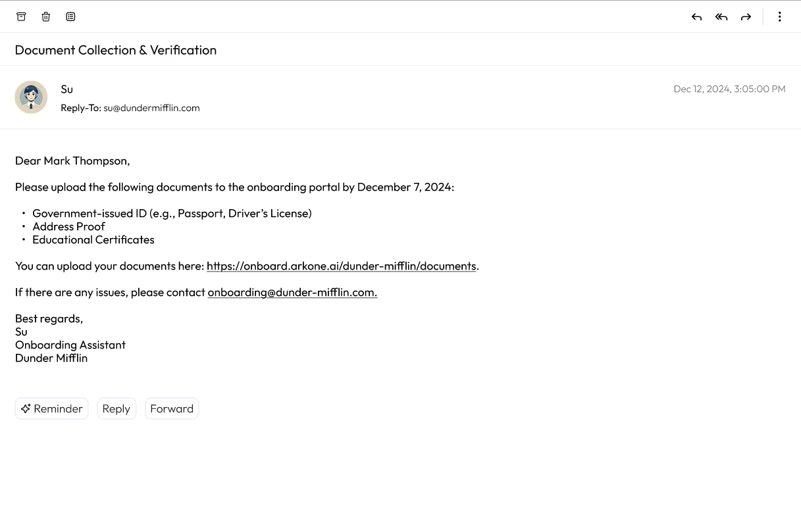

### Use Case 1: **Slack - Recruitment Assistance**

**Michael Scott**: Hey Su, we need a sales rep who can bring in the big bucks. You know, like a paper-selling shark! 🦈  

**Su**: Hi Michael, I’d be happy to assist. Can you confirm the job location, salary range, and any key skills or qualifications you’d like to include?  

**Michael Scott**: Uh, Scranton, of course. Salary… let’s say whatever Jim makes, but add 10% so it’s competitive. And they must be able to close deals like me.  

**Su**: Thank you for the details. I’ve drafted a job description for your review. You can find it here: [Sales Representative Job Draft Link](https://joinus.team/dunder-mifflin-inc/sales-representative-draft).  

**Michael Scott**: Perfect. Now let’s post it everywhere! LinkedIn, Glassdoor, Monster—blast it out there like a cannonball.  

**Su**: Understood. I’ll publish the job post across all platforms, including PeopleOfPaper, LinkedIn, Indeed, and Glassdoor. Here’s the published job link for tracking: [Sales Representative Job Link](https://joinus.team/dunder-mifflin-inc/sales-representative).  

**Michael Scott**: That’s what I’m talking about! Time is paper, Su.  

**Su**: I’ll keep you updated on applicants as they come in. If you need to review or adjust, the job board link is here: [Dunder Mifflin Job Board](https://joinus.team/dunder-mifflin-inc).  

**Michael Scott**: You’re a lifesaver, Su. < Way better than dealing with >.  //< >Delete after typing

**Su**: Thank you, Michael. I’m here to streamline the process. Let me know if there’s anything else you need.  

---

### Use Case 2: **Teams - Leave Request Management**

#### <u>**Pam's Teams Chat Window**</u>

**Pam Beesly**: Hi Su, I need to take next Friday off. Can you approve that?  

**Su**: Hi Pam! Just confirming, this is a vacation day, correct?  

**Pam Beesly**: Yup!  

**Su**: Thanks, Pam. Before finalizing, I’ll need to check with Michael since there are team meetings on your calendar and his. Let me confirm with him first.  

---
#### <u>**Michael Scott's Teams Chat Window**</u>

**Su (to Michael Scott)**: Hi Michael, Pam has requested leave for next Friday. However, there are team meetings scheduled on her calendar and yours. Would you like to approve the leave or reschedule the meetings?  

**Michael Scott**: Hmm. Meetings, shmeetings! Let her go. We’ll survive.  

**Su**: Understood. I’ll proceed with the approval and notify the team.  

---
#### <u>**Pam's Teams Chat Window**</u>

**Su (to Pam)**: Hi Pam, your leave for next Friday has been approved. I’ve updated your leave balance and notified Michael. Have a great day off!  

---
#### <u>**Michael's Teams Chat Window**</u>

**Michael Scott (chimes in)**: Su, you didn’t even need to check with me! You know I’m a “fun boss.”  

**Su**: Michael, I ensure all requests align with company policy and team schedules. Your input was valuable.  

**Michael Scott**: Valuable, huh? Maybe I’ll add that to my LinkedIn.  

**Su**: Let me know if you’d like assistance updating your LinkedIn profile, Michael.  

**Michael Scott**: …Carry on.  

---

### Use Case 3:  **WhatsApp - Performance Feedback**

**Dwight Schrute**: Su, I want to evaluate Jim’s performance.

**Su**: Certainly, Dwight. Would you like to use the structured 360-feedback template or provide an informal review?

**Dwight Schrute**: Make it structured. I’ll include points about how he never respects my beet expertise.

**Su**: Feedback is about professional performance, Dwight. I’ve removed unrelated comments and sent the template to you for final review.

**Dwight Schrute**: Fine. But you owe me.

**Su**: I’m an AI, Dwight. I don’t owe anyone.

---

### **Script 1: Creating & Updating the Talent Pool (Dashboard Update via Teams)**

**[Platform: Microsoft Teams]**  

**Jim Halpert:**  
Hey Su, did we get any new candidates from the “Future of Paper Products” trade show?  

**Su (via Teams):**  
Hi Jim, yes, I’ve added 15 new profiles to the Talent Pool from the event registrations. They’ve been tagged based on their expertise: “Sales Representatives,” “Logistics Specialists,” and “Product Designers.”  

**Jim Halpert:**  
Great. Can you flag the ones with prior experience in office supplies sales?  

**Su:**  
Done. Five candidates have been flagged as “Office Supplies Experts” for your quick review.  

---

### **Script 2: Candidate Segmentation (Dashboard Request via Slack)**

**[Platform: Slack]**  

**Dwight Schrute:**  
Su, I need candidates who can sell reams of paper like it’s gold. Filter the pool for those with 3+ years in sales and B2B experience.  

**Su (via Slack):**  
Certainly, Dwight. I’ve found 10 candidates matching your criteria. Would you like me to tag them as potential sales hires?  

**Dwight Schrute:**  
Yes. And add a note: “Ideal candidates for expanding our beet-paper initiative.”  

**Su:**  
Tags and notes added. They’re ready for your review on the Talent Pool dashboard.  

---

### **Script 3: Engagement with the Talent Community (Email Thread)**

**[Platform: Email]**

**Subject:** Exciting Sales Opportunities at Dunder Mifflin!  

**Email from Su:**  
Hi Emily Johnson,  

We’re growing our sales team to support exciting new office supply products. If you’re passionate about building client relationships and smashing sales targets, we’d love to connect.  

Click here to explore the opportunity: [https://joinus.team/dunder-mifflin/sales-representative](https://joinus.team/dunder-mifflin/sales-representative)

Best regards,  
Su, 
HR Manager
Dunder Mifflin

---

**Candidate Reply:**  
Hi Su,  

This sounds great! What’s the next step?  

Best,  
Emily  

---

**Su’s Response:**  
Hi Emily,  

Thank you for your interest! I’ve forwarded your details to the hiring manager. Expect a follow-up soon.  

Best regards,  
Su  

---

### **Script 4: Re-Engagement of Passive Candidates (Email Thread)**

**[Platform: Email]**

**Subject:** Let’s reconnect about exciting opportunities!  

**Email from Su:**  
Hi Mark Taylor,  

It’s been a while since we last connected. We’re currently looking for Sales Representatives to support our new eco-friendly paper line. If this aligns with your interests, we’d love to hear from you!  

Click here to learn more: [https://joinus.team/dunder-mifflin/sales-representative](https://joinus.team/dunder-mifflin/sales-representative)

Best regards,  
Su,
HR Manager
Dunder Mifflin 

---

**Candidate Reply:**  
Hi Su,  

I’m definitely interested in eco-friendly initiatives. Let’s connect!  

Best,  
Mark  

---

**Su’s Response:**  
Hi Mark,  

Thank you! I have shared your interest with the recruitment team. They will follow up shortly.  

Best regards,  
Su  

---

### **Script 5: Candidate Retargeting (Dashboard Alert via Teams)**

**[Platform: Microsoft Teams]**  

**Pam Beesly:**  
Su, can you identify candidates in the Talent Pool with logistics or supply chain experience?  

**Su:**  
Certainly, Pam. I’ve identified 8 candidates with relevant experience. Would you like me to notify them about the Warehouse Manager role?  

**Pam Beesly:**  
Yes, please.  

**Su:**  
Done. Personalized messages inviting them to apply have been sent. You can view their responses in the Talent Pool dashboard.  

---

### **Use Case 6: Engagement Through Events**

**[Platform: Email (Candidate) & Microsoft Teams (HR Team)]**

**Su (Email to Candidate, Sarah Brown):**  
Hi Sarah,

We’re hosting a **Career Day** at our Scranton office! 🎉

**What’s in store?**

-   Learn about our new product lines.
-   Meet our leadership team.
-   Explore career opportunities at Dunder Mifflin.

RSVP now: [https://event.joinus.team/dunder-mifflin/career-day-2025](https://event.joinus.team/dunder-mifflin/career-day-2025).

Looking forward to seeing you there!

Best regards,  
Su  
HR Manager  
Dunder Mifflin International

----------

**Reply from Sarah Brown (via Email):**  
Hi Su,

Thanks for the invite! I’m excited to attend. Could you share the agenda for the day?

Best,  
Sarah

----------

**Su (Email Reply to Sarah):**  
Hi Sarah,

Here’s the agenda for Career Day:

-   **10:00 AM:** Welcome Address by Michael Scott
-   **10:30 AM:** Product Demos and Q&A
-   **12:00 PM:** Networking Lunch with Leadership
-   **2:00 PM:** Career Opportunities Showcase

Let me know if you have further questions. See you there!

Best regards,  
Su

----------

**Reply from Sarah Brown (via Email):**  
Thanks, Su! Looking forward to meeting the team and exploring opportunities.

----------

**Su (Teams to HR Team Post-Event):**  
Hi Team,

The **Career Day** event was a success! Here’s a quick summary:

-   **Total Attendees:** 50
-   **Engagement:** 12 attendees expressed interest in exploring roles with us.
-   **Top Feedback:** Great product presentations but requests for longer Q&A sessions.

I’ve updated the Talent Pool with feedback and attendance data. You can review it here: [https://talent.joinus.team/dunder-mifflin/updates](https://talent.joinus.team/dunder-mifflin/updates).

Best regards,  
Su

----------

**Reply from Jim Halpert (Teams):**  
Great work, Su! I think the lunch was the real winner. Pam says people loved Dwight’s beet salad story.

----------

**Reply from Angela Martin (Teams):**  
Thanks, Su. Let’s ensure future events have more structured Q&A sessions. Feedback is key.

----------

**Reply from Michael Scott (Teams):**  
Amazing work, Su! Did you include my _“World’s Best Boss” mug_ in the networking session photos? We should use those for marketing.

----------

**Reply from Kelly Kapoor (Teams):**  
Career Day is awesome, but can we make the next one more Instagrammable? We need a photo booth with props like “Team Dunder!”

----------
 

---

### **Script 7: Proactive Talent Recommendations (Email)**

**[Platform: Email]**

**Subject:** Candidate Recommendations for Regional Sales Manager Role  

**Email from Su:**  
Hi Michael,  

I’ve identified three top candidates for the **Regional Sales Manager** role:  
- **James Carter**: 8 years in B2B sales, exceeded quarterly targets by 150%.  
- **Sophia Williams**: 10 years in paper products sales, expertise in managing large accounts.  
- **Ryan Edwards**: 6 years in office supplies sales, specializes in small business accounts.  

You can view the specific job posting here: [https://joinus.team/dunder-mifflin/regional-sales-manager](https://joinus.team/dunder-mifflin/regional-sales-manager).  

Please let me know if you’d like me to schedule interviews with any of them.  

Best regards,  
Su  

---

**Reply from Michael Scott:**  
Hi Su,  

Thanks for the recommendations. They all look great! Please proceed with scheduling interviews for James Carter and Sophia Williams. Let’s put Ryan Edwards on the watchlist for now.  

Also, can you make sure the candidates can access our career page at [https://joinus.team/dunder-mifflin/career](https://joinus.team/dunder-mifflin/career)?  

Best,  
Michael  

---

### **Script 8: Regular Talent Pool Maintenance (Slack Notification)**

**[Platform: Slack - Group Channel]**

**Su:**  
Hi Team,  

I’ve reached out to inactive candidates in the Talent Pool to update their profiles. Three candidates have responded with new certifications and skills, which I’ve added to their profiles.  

Additionally, I’ve archived 10 outdated profiles based on inactivity criteria. You can view the updated Talent Pool and job postings here: [https://joinus.team/dunder-mifflin](https://joinus.team/dunder-mifflin).  

Best,  
Su  

---

**Reply from Pam Beesly:**  
Thanks, Su! Can you share the details of the candidates who updated their profiles? Also, let me know if there are trends in the archived profiles we should address to avoid inactivity.  

**Reply from Dwight Schrute:**  
Good work, Su. Just ensure that none of the archived profiles had beet-related expertise—we can’t afford to lose talent in that area.  

---

### **Script 9: Automated Matching & Notifications (Email)**

**[Platform: Email]**

**Message to Candidate:**  
Hi Lisa Green,  

We have an opening for a **Warehouse Manager** role that matches your logistics expertise. You can view the job posting here: [https://joinus.team/dunder-mifflin/warehouse-manager](https://joinus.team/dunder-mifflin/warehouse-manager).  

Let me know if you’d like assistance with the application process!  

Best,  
Su  

---

**Reply from Lisa Green:**  
Hi Su,  

Thanks for reaching out! I’m interested in the role but need assistance with uploading my updated CV. Can you guide me through the process?  

**Su:**  
Hi Lisa,  

I’d be happy to help! You can upload your updated CV here: [https://joinus.team/dunder-mifflin/warehouse-manager](https://joinus.team/dunder-mifflin/warehouse-manager). Once uploaded, I’ll ensure it’s added to your application.  

Best,  
Su  

---

### **Script 10: Engagement Metrics & Insights (Teams Dashboard Update)**

**[Platform: Microsoft Teams - Group Channel]**

**Su:**  
Hi Team,  

Here are this month’s Talent Pool insights:  
- **Talent Pool Growth**: 25% increase.  
- **Top Engagement Source**: Career Fair registrations.  
- **Application Rate**: 40% from personalized email outreach.  

You can review the full insights and job postings here: [https://ats.joinus.team/report](https://joinus.team/dunder-mifflin).  

Please let me know if you’d like deeper insights or strategy adjustments.  

Best regards,  
Su  

---

**Reply from Jim Halpert:**  
These are solid metrics, Su. Can you drill down into the Career Fair registrations? I’d like to know which specific roles drew the most interest.  

**Reply from Angela Martin:**  
Great work, Su. Please also share the conversion rates for candidates applying to senior roles versus junior roles.  

---

----------

### **Use Case 11: Invoice Capture and Data Entry**

**[Platform: Email to Vendor, Teams to AP Manager]**

**Vendor Email:**  
Subject: Invoice Submission – INV202311

Dear Dunder Mifflin Accounts Payable Team,

Please find attached Invoice INV202311 for the delivery of 500 reams of A4 paper.

Best regards,  
Martin Wilson  
Wilson Paper Supplies

----------

**Su (via Teams to AP Manager, Pam Beesly):**  
Hi Pam,

Invoice INV202311 from Wilson Paper Supplies has been digitized and verified against PO100345. Details:

-   Amount: $4,750
-   Due Date: 15/12/2024

It’s ready for validation. You can review the invoice here: [https://ap.arkone.ai/t/invoice/INV202311](https://ap.arkone.ai/t/invoice/INV202311).

----------

### **Use Case 12: Automated Validation**

**[Platform: Teams to AP Manager, Email to Vendor]**

**Su (Teams to Pam Beesly):**  
Hi Pam,

Invoice INV202311 has passed all validations:

-   Matched PO100345.
-   Terms confirmed (net 30).
-   No duplicates detected.
-   Tax compliance verified.

Would you like to route it for approval? Click here to proceed: [https://ap.arkone.ai/t/invoice/INV202311?action=validation](https://ap.arkone.ai/t/invoice/INV202311?action=validation).

----------

**Su (Email to Vendor):**  
Subject: Invoice INV202311 Validation Complete

Dear Martin,

Your invoice INV202311 has been validated and routed for approval. We will notify you once the payment is scheduled.

Best regards,  
Su  
AP Assistant  
Dunder Mifflin

----------

### **Use Case 13: Approval Workflow**

**[Platform: Teams to Approver, Email to Vendor]**

**Su (Teams to Michael Scott):**  
Hi Michael,

Invoice INV202311 from Wilson Paper Supplies requires your approval.

-   Amount: $4,750
-   Due Date: 15/12/2024

Please review and approve here: [https://ap.arkone.ai/t/invoice/INV202311?action=approve](https://ap.arkone.ai/t/invoice/INV202311?action=approve).

----------

**Su (Email to Vendor):**  
Subject: Invoice INV202311 Approval Update

Dear Martin,

Your invoice INV202311 has been approved. We will notify you shortly when the payment is processed.

Best regards,  
Su  
AP Assistant  
Dunder Mifflin

----------

### **Use Case 14: Payment Scheduling**

**[Platform: Teams to AP Manager, Email to Vendor]**

**Su (Teams to Pam Beesly):**  
Hi Pam,

Payment for Invoice INV202311 has been scheduled for 13/12/2024 to take advantage of an early payment discount ($75 saved).

Would you like to proceed? Confirm here: [https://ap.arkone.ai/t/invoice/INV202311/payment/PAY34567?action=approve](https://ap.arkone.ai/t/invoice/INV202311/payment/PAY34567?action=approve).

----------

**Su (Email to Vendor):**  
Subject: Invoice INV202311 Payment Scheduled

Dear Martin,

We have scheduled the payment for Invoice INV202311 to be processed on 13/12/2024. You will receive confirmation once it has been completed.

Best regards,  
Su  
AP Assistant  
Dunder Mifflin

----------

### **Use Case 15: Reconciliation & Reporting**

**[Platform: Teams to AP Manager]**

**Su (Teams to Pam Beesly):**  
Hi Pam,

Reconciliation for November 2024 is complete:

-   **Invoices Paid:** 48 ($120,000 total).
-   **Overdue Invoices:** 3 ($5,800 total).
-   **Discount Savings:** $1,200.

A detailed report is ready for review here: [https://ap.arkone.ai/t/reports/nov2024](https://ap.arkone.ai/t/reports/nov2024).

----------

**Reply from Pam Beesly:**  
Thanks, Su. Can you highlight the reasons for the overdue invoices? I’d like to see if we can resolve them before they incur late fees.

**Su:**  
Hi Pam,

The overdue invoices were flagged for the following reasons:

1.  **Invoice INV202308**: Pricing discrepancy flagged by procurement.
2.  **Invoice INV202310**: Missing PO details from the vendor.
3.  **Invoice INV202315**: Approval delay due to a scheduling conflict.

Would you like me to prioritize follow-up on these?

----------

### **Use Case 16: Audit & Compliance**

**[Platform: Email to AP Team]**

**Su:**  
Subject: Audit-Ready Report for Q4 2024

Hi Team,

All invoices, approvals, and payment records for Q4 2024 have been archived.

-   **Total Invoices Processed:** 180
-   **Total Amount Paid:** $450,000
-   **Discrepancies Resolved:** 10

Audit reports are ready for submission and can be accessed here: [https://ap.arkone.ai/t/audit/Q42024](https://ap.arkone.ai/t/audit/Q42024).

Best regards,  
Su  
AP Assistant  
Dunder Mifflin

----------

**Reply from Angela Martin:**  
Thanks, Su. Can you provide a summary of the 10 discrepancies resolved? We may need to adjust our processes if similar issues persist.

**Su:**  
Hi Angela,

Here’s a summary of the 10 discrepancies resolved in Q4 2024:

1.  **Pricing Errors:** 4 cases (adjusted unit prices based on contracts).
2.  **Duplicate Submissions:** 2 cases (invoices resubmitted with minor edits).
3.  **Missing PO Details:** 3 cases (vendors provided updated documentation).
4.  **Tax Compliance Issues:** 1 case (corrected GST calculation).

I can generate a detailed report for process refinement if needed.

----------

### **Use Case 17: Vendor Communication (Payment Confirmation)**

**[Platform: Email to Vendor]**

**Su:**  
Subject: Payment Confirmation – INV202311

Dear Martin,

We’ve processed your payment for Invoice INV202311.

-   **Amount:** $4,750
-   **Payment Reference:** DM202412001
-   **Date:** 13/12/2024

Thank you for your continued partnership.

Best regards,  
Su  
AP Assistant  
Dunder Mifflin

----------

**Reply from Martin Wilson:**  
Dear Su,

Thank you for the confirmation. I’ll notify our accounts team. Also, could you send the payment reference details for Invoice INV202309 as we haven’t received confirmation for that one yet?

Best regards,  
Martin Wilson

**Su:**  
Dear Martin,

Thank you for bringing this to my attention. Payment for Invoice INV202309 was processed on 10/12/2024.

-   **Amount:** $3,200
-   **Payment Reference:** DM202411987

Please let me know if you require any additional information.

Best regards,  
Su  
AP Assistant  
Dunder Mifflin

----------

----------

### **Use Case 18: Offer Letter Acceptance**

**[Platform: Email to Candidate, Teams to HR Manager]**

**Su (Email to Candidate):**  
Subject: Welcome to Dunder Mifflin!

Dear Mark Thompson,

Congratulations on joining Dunder Mifflin! We’re excited to have you on board.

Here are the details for your onboarding process:

-   **First Day:** Monday, December 11, 2024
-   **Reporting Manager:** Michael Scott
-   **Onboarding Portal:** [https://onboard.arkone.ai/dunder-mifflin](https://onboard.arkone.ai/dunder-mifflin)

Please log in to complete your onboarding tasks and upload the required documentation. If you have any questions, feel free to reach out to us.

Best regards,  
Su  
Onboarding Assistant  
Dunder Mifflin

----------

**Reply from Mark Thompson (via email):**  
Dear Su,

Thank you for the warm welcome! I’m thrilled to join Dunder Mifflin. I’ve logged into the portal and will complete my tasks by this weekend.

Looking forward to my first day!

Best regards,  
Mark

----------

**Su (Teams to HR Manager, Pam Beesly):**  
Hi Pam,

Mark Thompson has accepted the offer for the **Sales Representative** role. He’s enthusiastic and has logged into the onboarding portal. Would you like me to prepare his first-day agenda?

**Reply from Pam Beesly (Teams):**  
Thanks, Su. Please go ahead and draft the first-day agenda.

----------

### **Use Case 19: Document Collection & Verification**

**[Platform: Email to Candidate, Teams to HR Manager]**

**Su (Email to Candidate):**  
Subject: Document Submission for Onboarding

Dear Mark Thompson,

Please upload the following documents to the onboarding portal by December 7, 2024:

-   Government-issued ID (e.g., Passport, Driver’s License)
-   Address Proof
-   Educational Certificates

You can upload your documents here: [https://onboard.arkone.ai/dunder-mifflin/documents](https://onboard.arkone.ai/dunder-mifflin/documents).

If there are any issues, please contact [onboarding@dunder-mifflin.com](mailto:onboarding@dunder-mifflin.com).

Best regards,  
Su  
Onboarding Assistant  
Dunder Mifflin

----------

**Reply from Mark Thompson (via email):**  
Dear Su,

I’ve uploaded my documents to the portal. Please let me know if anything else is required.

Best regards,  
Mark

----------

**Su (Teams to HR Manager):**  
Hi Pam,

Mark Thompson has uploaded his documents. They’ve been verified for completeness and accuracy. No discrepancies were found. I’ll now initiate the background verification process.

**Reply from Pam Beesly (Teams):**  
Perfect. Let’s proceed with the verification.

----------

### **Use Case 20: Company Policy Introduction**

**[Platform: Slack to New Hire]**

**Su (Slack Message to Mark Thompson):**  
Hi Mark,

Welcome to Dunder Mifflin! 🎉 To help you settle in, I’ve prepared an interactive onboarding session covering:

1.  Company mission, vision, and values.
2.  HR policies (leave, code of conduct, etc.).
3.  Security and compliance policies.

You can begin your session here: [https://onboard.arkone.ai/dunder-mifflin/policies](https://onboard.arkone.ai/dunder-mifflin/policies).

Let me know if you need assistance along the way.

----------

**Reply from Mark Thompson (via Slack):**  
Thanks, Su! I’ve completed the session. The policies are clear, and I loved the interactive format.

----------

**Su (Slack to Mark):**  
That’s great to hear, Mark! I’ve logged your completion. If you have any further questions about the policies, feel free to reach out.

----------

### **Use Case 21: Equipment and Workspace Setup**

**[Platform: Teams to IT Team, Email to New Hire]**

**Su (Teams to IT Team):**  
Hi IT Team,

Please prepare the following for new hire Mark Thompson (Sales Representative):

-   **Laptop Model:** Dell Latitude 7420
-   **Email Access:** [mark.thompson@dunder-mifflin.com](mailto:mark.thompson@dunder-mifflin.com)
-   **System Credentials:** Active Directory login setup

Target delivery date: December 8, 2024.

----------

**Su (Email to New Hire):**  
Subject: Equipment Delivery & System Access

Dear Mark,

Your laptop and system credentials are being prepared. You will receive them by December 8, 2024.

If you have any special requests, please reply to this email.

Best regards,  
Su  
Onboarding Assistant  
Dunder Mifflin

----------

**Reply from Mark Thompson (via email):**  
Dear Su,

Thank you for the update. Could you please confirm if I’ll also receive access to the CRM system on my first day?

Best regards,  
Mark

----------

**Su (via email):**  
Dear Mark,

Yes, your CRM access credentials will be included in your system setup. You’ll receive them along with your laptop.

Best regards,  
Su  
Onboarding Assistant  
Dunder Mifflin

----------

### **Use Case 22: Feedback Collection & Optimization**

**[Platform: Slack Message to New Hire, Email to HR Manager]**

**Su (Slack to Mark Thompson):**  
Hi Mark,

We hope your onboarding experience has been great so far! To help us improve, please share your feedback via this quick survey: [https://onboard.arkone.ai/dunder-mifflin/feedback](https://onboard.arkone.ai/dunder-mifflin/feedback).

Thank you for helping us make Dunder Mifflin even better!

----------

**Reply from Mark Thompson (via Slack):**  
Hi Su,

I’ve completed the feedback survey. Overall, the onboarding process has been smooth. The only suggestion I have is to include an FAQ section for quick reference.

----------

**Su (Slack to Mark):**  
Thanks, Mark! I’ve noted your suggestion and will include it in our next onboarding update.

----------

**Su (Email to HR Manager):**  
Subject: Onboarding Feedback Insights

Hi Pam,

I’ve consolidated feedback from recent hires, including Mark Thompson. Here are the highlights:

-   **Overall Satisfaction:** 92% positive.
-   **Improvement Areas:** Faster IT equipment setup (requested by 3 hires).
-   **Suggestions:** Add an FAQ section to the onboarding portal.

Let me know if you’d like a detailed report.

Best regards,  
Su  
Onboarding Assistant  
Dunder Mifflin

----------

### **Use Case 23: Vendor Lead Generation**

**[Platform: Email to Potential Vendors, Teams Notifications to Procurement Team]**

**Su (Email to Potential Vendor):**  
Subject: Partnership Opportunity with Dunder Mifflin

Dear Samantha Carter,

I’m reaching out on behalf of Dunder Mifflin’s Procurement Department. We are exploring partnerships for high-quality paper supplies and related services.

If you’re interested in collaborating, please fill out our Vendor Interest Form to share more about your offerings: [https://vendors.arkone.ai/dunder-mifflin/interest](https://vendors.arkone.ai/dunder-mifflin/interest).

We look forward to learning about your services.

Best regards,  
Su  
Vendor Procurement Assistant  
Dunder Mifflin

----------

**Reply from Samantha Carter (via email):**  
Dear Su,

Thank you for reaching out. I’ve completed the Vendor Interest Form and uploaded our product catalog and certifications. Please let me know the next steps.

Best regards,  
Samantha Carter  
Carter Supplies

----------

**Su (Teams Notification to Procurement Team):**  
Hi Team,

Samantha Carter from Carter Supplies has submitted the Vendor Interest Form. Details include:

-   Industry: Paper Supplies
-   Certifications: ISO 9001
-   Product Catalog: Uploaded

Would you like me to proceed with scoring and prioritization?

**Reply from Procurement Manager (Teams):**  
Yes, Su. Prioritize and send us the evaluation report.

----------

### **Use Case 24: Vendor Evaluation and Selection**

**[Platform: Email to Vendor, Teams Notifications to Procurement Team]**

**Su (Teams to Procurement Team):**  
Hi Team,

I’ve completed the evaluation for Carter Supplies based on their submission:

-   **Score:** 85/100
-   **Strengths:** Industry certifications, competitive pricing, capacity to meet requirements.
-   **Risks:** Slightly longer delivery timelines.

You can review the detailed report here: [https://vendors.arkone.ai/dunder-mifflin/evaluation/carter-supplies](https://vendors.arkone.ai/dunder-mifflin/evaluation/carter-supplies).

Would you like to shortlist them for the next stage?

**Reply from Procurement Manager (Teams):**  
Yes, Su. Schedule an interview with Carter Supplies.

----------

**Su (Email to Vendor):**  
Subject: Vendor Interview Invitation

Dear Samantha Carter,

Thank you for your interest in partnering with Dunder Mifflin. We’d like to invite you for a discussion to understand your offerings better.

**Date:** Wednesday, December 6, 2024  
**Time:** 10:00 AM EST  
**Location:** Virtual (Google Meet link provided after confirmation)

Please confirm your availability.

Best regards,  
Su  
Vendor Procurement Assistant  
Dunder Mifflin

----------

**Reply from Samantha Carter (via email):**  
Dear Su,

Thank you for the invitation. I’m available on December 6 at 10:00 AM EST. Please share the meeting link.

Best regards,  
Samantha Carter

----------

**Su (Email to Vendor):**  
Dear Samantha,

Thank you for confirming. Here’s the meeting link for our discussion: [https://meet.google.com/dunder-mifflin-procurement](https://meet.google.com/dunder-mifflin-procurement).

Looking forward to speaking with you.

Best regards,  
Su  
Vendor Procurement Assistant  
Dunder Mifflin

----------

### **Use Case 25: Vendor Contracting**

**[Platform: Email to Vendor, Teams Notifications to Procurement Team]**

**Su (Email to Vendor):**  
Subject: Vendor Agreement for Review

Dear Samantha Carter,

We’ve drafted the contract for our partnership. The contract includes:

-   **Scope of Work:** Paper supply services.
-   **Payment Terms:** Net 30 days.
-   **Penalties:** Delays and non-compliance clauses.

Please review the contract here: [https://vendors.arkone.ai/dunder-mifflin/contracts/carter-supplies](https://vendors.arkone.ai/dunder-mifflin/contracts/carter-supplies).

Once approved, you can e-sign the document through the portal.

Best regards,  
Su  
Vendor Procurement Assistant  
Dunder Mifflin

----------

**Reply from Samantha Carter (via email):**  
Dear Su,

I’ve reviewed the contract and signed it. Please let me know if further steps are required.

Best regards,  
Samantha Carter

----------

**Su (Teams Notification to Procurement Team):**  
Hi Team,

Carter Supplies has reviewed and signed the vendor agreement. The onboarding process is complete, and their profile has been integrated into the procurement and finance systems.

Would you like me to initiate their first purchase order?

**Reply from Procurement Manager (Teams):**  
Yes, Su. Prepare the purchase order.

----------

### **Use Case 26: Post-Onboarding Vendor Management**

**[Platform: Email to Vendor, Teams Notification to Procurement Team]**

**Su (Email to Vendor):**  
Subject: Vendor Performance Feedback

Dear Samantha Carter,

We’d like to share feedback on your recent deliveries:

-   **Delivery Times:** Excellent.
-   **Quality of Goods:** Meets expectations.
-   **Issue Resolution:** Quick and effective.

We appreciate your partnership and look forward to working on upcoming projects.

Best regards,  
Su  
Vendor Procurement Assistant  
Dunder Mifflin

----------

**Reply from Samantha Carter (via email):**  
Dear Su,

Thank you for the feedback! It’s a pleasure working with Dunder Mifflin. Please let me know if there are additional opportunities to support your team.

Best regards,  
Samantha Carter

----------

**Su (Teams Notification to Procurement Team):**  
Hi Team,

Vendor feedback has been shared with Carter Supplies. They’ve expressed interest in additional opportunities. Would you like me to prepare an RFP for our next project?

**Reply from Procurement Manager (Teams):**  
Yes, Su. Let’s move forward with the RFP.

----------

----------

### **Tech Startup Overview: Pied Piper**

-   **Industry:** Tech (Compression Algorithms, AI, and Cloud Storage)
-   **Size:** 120 employees (Series C funded)
-   **Core Challenge:** Scaling operations while managing rapid growth.
-   **Mission:** Building next-gen compression algorithms for ultra-fast data transfer.

----------

### **Use Case 1: Engineering - Feature Release Workflow**

**[Platform: Teams Notifications, Slack Updates, Email to Stakeholders]**

**Su (Teams to Lead Developer, Dinesh Chugtai):**  
Hi Dinesh,

The QA team has approved the new **Video Compression Algorithm v2.3**. Would you like me to initiate the feature release process?

----------

**Reply from Dinesh Chugtai (Teams):**  
Yes, Su. Let’s schedule the release for this Friday at 10:00 AM PST.

----------

**Su (Slack Update to Engineering Team):**  
Hi Team,

The **Video Compression Algorithm v2.3** release is scheduled for Friday at 10:00 AM PST. Key updates include:

-   **Improved Compression Speed:** 25% faster.
-   **Reduced Latency:** Optimized for 4K streaming.

Please ensure your respective tasks are completed by Thursday evening.

----------

**Su (Email to Stakeholders):**  
Subject: Scheduled Feature Release – Video Compression Algorithm v2.3

Dear Team,

We’re excited to announce the release of **Video Compression Algorithm v2.3** on Friday, December 8, 2024, at 10:00 AM PST. This update includes significant improvements to compression speed and latency.

Feel free to reach out for additional details or concerns.

Best regards,  
Su  
Operations Assistant  
Pied Piper

----------

### **Use Case 2: HR - Employee Onboarding**

**[Platform: Email to New Hire, Teams to HR Manager, Slack Welcome Message]**

**Su (Email to New Hire, Monica Hall):**  
Subject: Welcome to Pied Piper!

Dear Monica,

Congratulations on joining Pied Piper as our new **Head of Business Development**!

Here’s what you need to know for your first day:

-   **Start Date:** Monday, December 11, 2024
-   **Reporting Manager:** Richard Hendricks
-   **Onboarding Portal:** [https://onboard.piedpiper.ai/monica-hall](https://onboard.piedpiper.ai/monica-hall)

We look forward to seeing you transform our business growth.

Best regards,  
Su  
HR Assistant  
Pied Piper

----------

**Reply from Monica Hall (via email):**  
Dear Su,

Thank you for the warm welcome! I’m excited to get started and will complete my onboarding tasks by this weekend.

Best regards,  
Monica

----------

**Su (Teams to HR Manager, Jared Dunn):**  
Hi Jared,

Monica Hall has completed her onboarding tasks. All documents are verified, and her first-day agenda is ready. Would you like me to schedule her introduction meeting with Richard Hendricks?

**Reply from Jared Dunn (Teams):**  
Yes, Su. Let’s schedule it at 10:00 AM on Monday.

----------

**Su (Slack to General Channel):**  
Hi Team,

Please welcome **Monica Hall**, our new Head of Business Development! 🎉 She’ll be leading our growth strategy and partnerships.

Feel free to reach out and say hi.

----------

### **Use Case 3: Sales - Lead Prioritization and Outreach**

**[Platform: Email to Lead, Teams to Sales Manager, Slack to Sales Team]**

**Su (Teams to Sales Manager, Gilfoyle):**  
Hi Gilfoyle,

I’ve identified a high-priority lead from the **AI Cloud Storage** segment:

-   **Name:** Sarah Blake
-   **Company:** DataFast
-   **Position:** CTO
-   **Opportunity:** $500,000 annual deal

Would you like me to send an introduction email?

**Reply from Gilfoyle (Teams):**  
Yes, send it and loop me in for the follow-up.

----------

**Su (Email to Lead):**  
Subject: Revolutionize Your Cloud Storage with Pied Piper

Dear Sarah,

I’m reaching out to share how Pied Piper’s compression algorithms can optimize your cloud storage, reducing costs by up to 40%.

Let’s discuss how we can support your goals. Are you available for a quick call this week?

Best regards,  
Su  
Sales Assistant  
Pied Piper

----------

**Reply from Sarah Blake (via email):**  
Dear Su,

Thank you for reaching out. I’m interested in learning more. Let’s schedule a call for Wednesday at 3:00 PM PST.

Best regards,  
Sarah

----------

**Su (Slack to Sales Team):**  
Hi Team,

Sarah Blake (CTO, DataFast) has scheduled a call for Wednesday at 3:00 PM PST. Gilfoyle will lead the discussion. Please ensure the sales deck is updated with our latest case studies.

----------

### **Use Case 4: Marketing - Campaign Launch**

**[Platform: Slack to Marketing Team, Email to Subscribers]**

**Su (Slack to Marketing Team):**  
Hi Team,

The new **"Compression Meets Speed" Campaign** is ready for launch! 🎯  
Here’s the plan:

-   **Start Date:** December 6, 2024
-   **Channels:** LinkedIn, Twitter, Email
-   **Goal:** Drive 1,000 leads in Q1 2025.

Please review the content calendar here: [https://marketing.piedpiper.ai/calendar](https://marketing.piedpiper.ai/calendar).

----------

**Su (Email to Subscribers):**  
Subject: Experience Unmatched Compression Speed

Dear Subscriber,

We’re thrilled to announce Pied Piper’s **Video Compression Algorithm v2.3**, delivering 25% faster compression with lower latency.

Explore how this can transform your data needs: [https://piedpiper.ai/explore](https://piedpiper.ai/explore).

Join the future of compression today!

Best regards,  
Su  
Marketing Assistant  
Pied Piper

----------

**Reply from Subscriber (via email):**  
Dear Su,

This sounds exciting! Can you share technical documentation for integration?

Best regards,  
Chris Taylor

**Su (Email Response):**  
Dear Chris,

Thank you for your interest. Please find the technical documentation here: [https://piedpiper.ai/documentation](https://piedpiper.ai/documentation).

Let me know if you have further questions.

Best regards,  
Su  
Marketing Assistant  
Pied Piper

----------

### **Use Case 5: Operations - Vendor Management**

**[Platform: Email to Vendor, Teams to Procurement Manager]**

**Su (Email to Vendor):**  
Subject: Partnership Opportunity

Dear Kevin Martinez,

Pied Piper is seeking reliable hardware suppliers for our growing data centers. We’re impressed with your portfolio and would like to explore a partnership.

Please submit your proposal here: [https://vendors.piedpiper.ai/submit](https://vendors.piedpiper.ai/submit).

Looking forward to hearing from you.

Best regards,  
Su  
Operations Assistant  
Pied Piper

----------

**Reply from Kevin Martinez (via email):**  
Dear Su,

Thank you for reaching out. I’ve submitted the proposal, including pricing and timelines. Please let me know if additional details are required.

Best regards,  
Kevin

----------

**Su (Teams to Procurement Manager, Jared Dunn):**  
Hi Jared,

Kevin Martinez has submitted a proposal for hardware supply. You can review it here: [https://vendors.piedpiper.ai/review](https://vendors.piedpiper.ai/review).

Would you like me to schedule a meeting with Kevin for further discussions?

**Reply from Jared Dunn (Teams):**  
Yes, Su. Schedule the meeting for Thursday at 2:00 PM PST.

----------

----------

### **Finance & Banking Company Overview: Goliath National Bank (GNB)**

-   **Industry:** Finance & Banking (Consumer Banking, Corporate Loans, Wealth Management)
-   **Size:** 15,000+ employees (Global Presence)
-   **Core Challenge:** Balancing customer service excellence with robust risk management and compliance.
-   **Mission:** Providing innovative financial solutions with a human touch.

----------

### **Use Case 1: Risk Management - Loan Risk Assessment**

**[Platform: Teams Notifications, Email to Risk Manager]**

**Su (Teams to Risk Manager, Marshall Eriksen):**  
Hi Marshall,

The automated system has flagged the following high-risk loan applications based on credit score and debt-to-income ratio:

1.  **Applicant Name:** Sarah Jenkins
    
    -   **Loan Amount:** $500,000
    -   **Risk Factor:** Low credit score (550).
2.  **Applicant Name:** Thomas Wang
    
    -   **Loan Amount:** $750,000
    -   **Risk Factor:** High DTI (60%).

Would you like me to initiate manual reviews for these cases?

----------

**Reply from Marshall Eriksen (Teams):**  
Yes, Su. Let’s prioritize Thomas Wang’s case for a manual review. Please prepare a detailed risk report.

----------

**Su (Email to Risk Manager):**  
Subject: Risk Report - Loan Application (Thomas Wang)

Dear Marshall,

Please find the detailed risk report for Thomas Wang’s loan application here: [https://gnb.arkone.ai/reports/thomas-wang](https://gnb.arkone.ai/reports/thomas-wang).

Let me know if further analysis is needed.

Best regards,  
Su  
Risk Management Assistant  
Goliath National Bank

----------

**Reply from Marshall Eriksen (via email):**  
Thanks, Su. I’ve reviewed the report. Please schedule a meeting with the underwriting team to discuss risk mitigation strategies.

----------

### **Use Case 2: Customer Service - Account Issue Resolution**

**[Platform: Email to Customer, Teams to Customer Support Manager]**

**Su (Email to Customer):**  
Subject: Resolution of Your Account Issue

Dear Mr. Barney Stinson,

Thank you for reaching out regarding the discrepancy in your checking account balance. Upon investigation, we found the following:

-   The $2,500 transaction flagged on December 3 was a duplicate entry.
-   This has been corrected, and your updated balance is $18,000.

We sincerely apologize for the inconvenience caused. Please let us know if there’s anything else we can assist you with.

Best regards,  
Su  
Customer Support Assistant  
Goliath National Bank

----------

**Reply from Barney Stinson (via email):**  
Dear Su,

Thank you for the prompt resolution. You guys are **legendary**!

Best regards,  
Barney

----------

**Su (Teams to Customer Support Manager):**  
Hi Team,

Barney Stinson’s account issue has been resolved. The duplicate transaction was corrected, and the customer has expressed satisfaction.

Would you like me to escalate this for an internal audit to prevent similar issues?

**Reply from Customer Support Manager (Teams):**  
Yes, Su. Please escalate this to the audit team for review.

----------

### **Use Case 3: Loan Processing - Application Status Updates**

**[Platform: Email to Customer, Teams to Loan Officer]**

**Su (Email to Customer):**  
Subject: Loan Application Update

Dear Lily Aldrin,

We’re excited to inform you that your loan application for $250,000 has been **pre-approved**.

Here are the next steps:

1.  Upload the required documents via the portal: [https://gnb.arkone.ai/loan/lily-aldrin/documents](https://gnb.arkone.ai/loan/lily-aldrin/documents).
2.  Complete the digital signature process.

Our loan officer will reach out shortly to finalize the process.

Best regards,  
Su  
Loan Processing Assistant  
Goliath National Bank

----------

**Reply from Lily Aldrin (via email):**  
Dear Su,

That’s wonderful news! I’ll upload the documents by tomorrow. Please let me know if there’s a deadline for submission.

Best regards,  
Lily

----------

**Su (Teams to Loan Officer):**  
Hi Team,

Lily Aldrin’s loan application has been pre-approved. She plans to upload the required documents tomorrow. Would you like me to send her a submission deadline reminder?

**Reply from Loan Officer (Teams):**  
Yes, Su. Set the deadline for this Friday and notify her.

----------

### **Use Case 4: Marketing - Campaign for Premium Credit Cards**

**[Platform: Email to Customers, Slack to Marketing Team]**

**Su (Slack to Marketing Team):**  
Hi Team,

The **“Elite Rewards Credit Card” Campaign** is live! 🎯

-   **Target Audience:** Customers with a credit score above 750.
-   **Goal:** Convert 1,000 new applications by Q1 2025.
-   **Channels:** Email, social media, and website pop-ups.

You can track campaign performance here: [https://gnb.arkone.ai/campaign/elite-rewards](https://gnb.arkone.ai/campaign/elite-rewards).

----------

**Su (Email to Customer):**  
Subject: Upgrade to Elite Rewards Credit Card

Dear Robin Scherbatsky,

We’re thrilled to offer you the **Elite Rewards Credit Card**, tailored for high achievers like you.

-   **Exclusive Perks:** Earn 3x points on travel, dining, and entertainment.
-   **Annual Fee:** Waived for the first year.

Apply now and unlock premium benefits: [https://gnb.arkone.ai/apply/elite-rewards](https://gnb.arkone.ai/apply/elite-rewards).

Best regards,  
Su  
Marketing Assistant  
Goliath National Bank

----------

**Reply from Robin Scherbatsky (via email):**  
Dear Su,

This looks great! I’ll apply later today. Can you confirm if there are any income requirements?

Best regards,  
Robin

----------

**Su (Email Response):**  
Dear Robin,

Thank you for your interest! The Elite Rewards Credit Card requires a minimum annual income of $100,000. If you meet the criteria, feel free to proceed with your application.

Best regards,  
Su  
Marketing Assistant  
Goliath National Bank

----------

### **Use Case 5: Compliance - AML (Anti-Money Laundering) Alert**

**[Platform: Teams to Compliance Manager, Email to Regulatory Team]**

**Su (Teams to Compliance Manager, Arthur Hobbs):**  
Hi Arthur,

An AML alert has been triggered for the following transaction:

-   **Account Name:** James Mosby
-   **Transaction Amount:** $200,000
-   **Flagged Activity:** Unusual foreign wire transfer.

Would you like me to initiate an internal investigation?

----------

**Reply from Arthur Hobbs (Teams):**  
Yes, Su. Launch the investigation and compile a report for the regulatory team.

----------

**Su (Email to Regulatory Team):**  
Subject: AML Alert - Investigation Report

Dear Team,

An AML alert was triggered for a $200,000 wire transfer in James Mosby’s account. Please find the investigation details here: [https://gnb.arkone.ai/compliance/aml/james-mosby](https://gnb.arkone.ai/compliance/aml/james-mosby).

The account has been temporarily frozen pending your review.

Best regards,  
Su  
Compliance Assistant  
Goliath National Bank

----------

**Reply from Regulatory Team (via email):**  
Dear Su,

We’ve reviewed the report and will follow up with additional actions. Please ensure the account remains frozen until further notice.

Best regards,  
Regulatory Team

----------
----------

### **Talent Management Company Overview: Entourage Talent Agency (ETA)**

-   **Industry:** Talent Management (Actors, Athletes, Influencers)
-   **Size:** 500 employees managing 2,000+ clients globally.
-   **Core Challenge:** Balancing talent acquisition, client relationships, and performance analytics with innovative strategies.
-   **Mission:** Shaping the future of entertainment and sports talent through strategic management.

----------

### **Use Case 1: Recruitment - Talent Scout Workflow**

**[Platform: Slack Updates, Email to Talent Scouts, Teams to Recruitment Manager]**

**Su (Slack to Talent Scouts):**  
Hi Team,

We’ve identified three emerging influencers with high potential for brand collaborations:

1.  **Name:** Maya Patel
    
    -   **Followers:** 150K (Lifestyle & Travel).
    -   **Engagement Rate:** 6.5%.
2.  **Name:** Jordan Lee
    
    -   **Followers:** 300K (Fitness & Nutrition).
    -   **Engagement Rate:** 5.8%.
3.  **Name:** Ella Carter
    
    -   **Followers:** 200K (Fashion & Beauty).
    -   **Engagement Rate:** 7.2%.

Would you like me to initiate outreach?

----------

**Reply from Talent Scout (Slack):**  
Great finds, Su! Start with Maya and Ella for initial conversations.

----------

**Su (Email to Influencer):**  
Subject: Collaboration Opportunity with Entourage Talent Agency

Dear Maya,

I’m Su, representing Entourage Talent Agency. We’re impressed by your work in lifestyle and travel and believe you’d be a great fit for our roster.

Let’s schedule a time to discuss how we can support your brand growth. Are you available this week?

Best regards,  
Su  
Recruitment Assistant  
Entourage Talent Agency

----------

**Reply from Maya Patel (via email):**  
Dear Su,

Thank you for reaching out! I’d love to explore this opportunity. I’m available Thursday at 3:00 PM EST.

Best regards,  
Maya

----------

**Su (Teams to Recruitment Manager, Ari Gold):**  
Hi Ari,

Maya Patel has agreed to a meeting on Thursday at 3:00 PM EST. I’ve added it to your calendar.

----------

### **Use Case 2: Client Management - Talent Profile Updates**

**[Platform: Slack Updates, Email to Clients, Teams to Account Manager]**

**Su (Slack to Account Manager, Eric Murphy):**  
Hi Eric,

I’ve updated the profiles for the following clients based on their recent projects:

1.  **Vincent Chase:** Added role in "Aquaman 2" and gross earnings from endorsements.
2.  **Sloan McQuewick:** Updated portfolio with her new campaign for L’Oréal.

Would you like to notify the clients for confirmation?

**Reply from Eric Murphy (Slack):**  
Yes, Su. Notify both Vince and Sloan to confirm.

----------

**Su (Email to Client, Vincent Chase):**  
Subject: Profile Update Confirmation

Dear Vincent,

We’ve updated your profile to include your role in **Aquaman 2** and endorsement earnings. Please review the changes here: [https://eta.arkone.ai/profiles/vincent-chase](https://eta.arkone.ai/profiles/vincent-chase).

Let us know if any additional updates are needed.

Best regards,  
Su  
Client Management Assistant  
Entourage Talent Agency

----------

**Reply from Vincent Chase (via email):**  
Hi Su,

Looks perfect. Thanks for keeping it updated!

Best,  
Vince

----------

**Su (Slack to Eric Murphy):**  
Hi Eric,

Vincent has confirmed the updates. Would you like me to finalize the portfolio and notify the PR team?

**Reply from Eric Murphy (Slack):**  
Yes, finalize and notify PR.

----------

### **Use Case 3: Performance Tracking - Analytics Report**

**[Platform: Teams Notification to Analytics Manager, Email to Talent Managers]**

**Su (Teams to Analytics Manager, Lloyd Lee):**  
Hi Lloyd,

The monthly performance analytics are ready. Key insights:

-   **Top Performer:** Ella Carter (ROI: 220%).
-   **Best Campaign:** Vincent Chase’s "Aquaman 2" promo (150K new fans).
-   **Engagement Trends:** Influencers in lifestyle niches saw a 10% engagement increase.

You can view the full report here: [https://eta.arkone.ai/reports/november2024](https://eta.arkone.ai/reports/november2024).

Would you like me to schedule a review meeting?

**Reply from Lloyd Lee (Teams):**  
Yes, Su. Schedule a meeting with the talent managers for next Tuesday.

----------

**Su (Email to Talent Managers):**  
Subject: Monthly Performance Review Meeting

Dear Team,

The November performance analytics report is ready. Key highlights include top-performing talents and engagement trends.

**Meeting Details:**

-   **Date:** Tuesday, December 12, 2024
-   **Time:** 2:00 PM EST
-   **Link:** [https://meet.eta.arkone.ai/performance-review](https://meet.eta.arkone.ai/performance-review)

Please review the report beforehand: [https://eta.arkone.ai/reports/november2024](https://eta.arkone.ai/reports/november2024).

Best regards,  
Su  
Analytics Assistant  
Entourage Talent Agency

----------

### **Use Case 4: Employee Development - Training Program Enrollment**

**[Platform: Slack Notifications, Email to Employees, Teams to HR Manager]**

**Su (Slack to HR Manager, Dana Gordon):**  
Hi Dana,

The following employees are eligible for the **Advanced Talent Negotiation Training** based on their recent performance reviews:

1.  **Name:** Sophia Reyes
2.  **Name:** Jonathan Lee

Would you like me to notify them?

**Reply from Dana Gordon (Slack):**  
Yes, Su. Let them know and share the enrollment details.

----------

**Su (Email to Employee, Sophia Reyes):**  
Subject: Training Opportunity - Advanced Talent Negotiation

Dear Sophia,

Based on your excellent performance, you’ve been selected for the **Advanced Talent Negotiation Training Program**.

**Details:**

-   **Start Date:** January 10, 2025
-   **Duration:** 4 weeks
-   **Location:** Virtual

Enroll here by December 20, 2024: [https://eta.arkone.ai/training/enrollment](https://eta.arkone.ai/training/enrollment).

Best regards,  
Su  
Employee Development Assistant  
Entourage Talent Agency

----------

**Reply from Sophia Reyes (via email):**  
Dear Su,

Thank you for the opportunity! I’ve enrolled and am excited to participate.

Best regards,  
Sophia

----------

#
### **Use Case 5: Marketing - Campaign for New Talent Recruitment**

**[Platform: Email to Prospective Talent, Slack to Marketing Team]**

**Su (Slack to Marketing Team):**  
Hi Team,

The “Join the Entourage” Recruitment Campaign is ready for launch! 🎉

**Goal:** Attract 100 new talents by Q2 2025.  
**Channels:** Instagram, LinkedIn, Email.  
**Target Audience:** Influencers and budding actors.

Track campaign performance here: [https://eta.arkone.ai/campaign/join-the-entourage](https://eta.arkone.ai/campaign/join-the-entourage).

----------

**Reply from Kelly Kapoor (Slack):**  
This is amazing, Su! But can we add TikTok to the channels? That’s where the real influencers are.

----------

**Reply from Jim Halpert (Slack):**  
Su, how do we make sure the “budding actors” aren’t just Michael’s improv buddies again? We need some screening questions.

----------

**Reply from Angela Martin (Slack):**  
Su, let’s ensure the LinkedIn posts are professional. Last time, someone added a hashtag that was… questionable.

----------

**Reply from Ryan Howard (Slack):**  
Love it. Su, make sure Instagram posts include dynamic reels. Static posts are dead.

----------

**Su (Email to Prospective Talent):**  
Subject: Join the Entourage Talent Family

Dear Alex Martinez,

Are you ready to take your career to the next level? **Entourage Talent Agency** is now onboarding new talent for 2025.

**Why join us?**

-   Access to top-tier brand collaborations.
-   Professional development opportunities.
-   360° talent management.

**Apply here:** [https://eta.arkone.ai/apply](https://eta.arkone.ai/apply).

Best regards,  
Su  
Marketing Assistant  
Entourage Talent Agency

----------

**Reply from Alex Martinez (via email):**  
Dear Su,

Thank you for reaching out! I’m very interested and have applied via the link. Could you share more details about the onboarding process?

Best regards,  
Alex

----------

**Su (Reply to Alex Martinez via email):**  
Dear Alex,

Thank you for applying! Our onboarding process involves:

1.  A virtual introduction session.
2.  Talent assessment and portfolio review.
3.  Matching opportunities with your skills and aspirations.

You’ll receive further details within 48 hours. Let me know if you have any questions.

Best regards,  
Su  
Marketing Assistant  
Entourage Talent Agency

----------

**Reply from another prospect (via email):**  
Dear Su,

Do you have opportunities for behind-the-scenes roles? I’m more interested in production and talent management.

Best regards,  
Samantha Lee

----------

**Su (Reply to Samantha Lee via email):**  
Dear Samantha,

Thank you for your interest! Yes, we have roles available in production and talent management. Please visit [https://eta.arkone.ai/roles](https://eta.arkone.ai/roles) to explore opportunities and submit your application.

Looking forward to your application!

Best regards,  
Su  
Marketing Assistant  
Entourage Talent Agency

----------

### **Professional Services Company Overview: Pearson Hardman**

-   **Industry:** Legal and Consulting Services
-   **Size:** 1,000 employees specializing in corporate and individual legal representation.
-   **Core Challenge:** Managing complex client cases, maintaining billable hours, and acquiring high-value clients.
-   **Mission:** Providing unparalleled legal and consulting expertise to shape success stories.

----------

### **Use Case 1: Client Acquisition - High-Value Lead Outreach**

**[Platform: Email to Potential Clients, Slack to Business Development Team]**

**Su (Email to Potential Client, Harvey Specter):**  
Subject: Legal Expertise Tailored to Your Business

Dear Rachel McAdams,

At Pearson Hardman, we specialize in providing comprehensive legal solutions for businesses like yours. With a proven track record in corporate law, we’d love to discuss how we can support your growth.

Let’s schedule a quick call to explore potential synergies. Are you available this week?

Best regards,  
Su  
Business Development Assistant  
Pearson Hardman

----------

**Reply from Rachel McAdams (via email):**  
Dear Su,

Thank you for reaching out. I’m interested in learning more. I’m available on Wednesday at 11:00 AM EST.

Best regards,  
Rachel

----------

**Su (Slack to Business Development Team):**  
Hi Team,

Rachel McAdams, CEO of RedStar Inc., has scheduled a call for Wednesday at 11:00 AM EST. Harvey Specter will lead the discussion.

Would you like me to prepare a briefing document on RedStar Inc.?

**Reply from Harvey Specter (Slack):**  
Yes, Su. Include recent financials and legal challenges from public records.

----------

### **Use Case 2: Case Management - Contract Review Workflow**

**[Platform: Teams Notifications, Email to Client, Slack to Legal Team]**

**Su (Teams to Legal Associate, Mike Ross):**  
Hi Mike,

The initial review of the **Acquisition Contract** for Specter Pharmaceuticals is complete. Key findings include:

-   Ambiguity in penalty clauses for delayed milestones.
-   Missing non-compete agreement for key personnel.

Would you like me to escalate this to the senior partner for revisions?

----------

**Reply from Mike Ross (Teams):**  
Yes, escalate this to Jessica Pearson for review and input.

----------

**Su (Email to Client, Specter Pharmaceuticals):**  
Subject: Updates on Acquisition Contract Review

Dear Team,

We’ve identified critical areas in the acquisition contract that require revisions:

-   Penalty clauses for delayed milestones.
-   Non-compete agreement for key personnel.

Our team is working on revisions and will share the updated contract by Friday.

Best regards,  
Su  
Case Management Assistant  
Pearson Hardman

----------

**Reply from Client (via email):**  
Dear Su,

Thank you for the update. Please prioritize the non-compete agreement as it’s critical for us.

Best regards,  
John Carter

----------

**Su (Slack to Legal Team):**  
Hi Team,

The client has emphasized prioritizing the non-compete agreement in the revised contract. Let’s focus on delivering this by Friday.

----------

### **Use Case 3: Billing - Invoice Management and Payment Tracking**

**[Platform: Email to Client, Teams Notification to Billing Team]**

**Su (Email to Client, Rachel Zane):**  
Subject: Invoice for Legal Services - November 2024

Dear Rachel,

Please find attached the invoice for legal services rendered in November 2024:

-   **Total Amount:** $25,000
-   **Due Date:** December 15, 2024

You can make the payment here: [https://pearsonhardman.arkone.ai/payments](https://pearsonhardman.arkone.ai/payments).

Feel free to reach out if you have any questions.

Best regards,  
Su  
Billing Assistant  
Pearson Hardman

----------

**Reply from Rachel Zane (via email):**  
Dear Su,

I’ve received the invoice and will ensure payment is processed by the due date.

Best regards,  
Rachel

----------

**Su (Teams Notification to Billing Team):**  
Hi Team,

Rachel Zane has acknowledged the November invoice and confirmed payment by December 15. Would you like me to follow up with a payment reminder closer to the due date?

**Reply from Billing Manager (Teams):**  
Yes, Su. Set a reminder for December 12.

----------

### **Use Case 4: Employee Development - CLE (Continuing Legal Education) Program Enrollment**

**[Platform: Email to Employees, Slack to HR Team]**

**Su (Email to Employees):**  
Subject: Continuing Legal Education Program - Enrollment Open

Dear Team,

Pearson Hardman is committed to your professional growth. We’re pleased to announce the **2025 Continuing Legal Education Program** with the following focus areas:

1.  Corporate Law Updates.
2.  Digital Transformation in Legal Practice.

**Details:**

-   **Start Date:** January 15, 2025
-   **Duration:** 6 weeks (online modules)
-   **Enroll by:** December 31, 2024

Enroll here: [https://pearsonhardman.arkone.ai/cle-enrollment](https://pearsonhardman.arkone.ai/cle-enrollment).

Best regards,  
Su  
HR Assistant  
Pearson Hardman

----------

**Reply from Employee (via email):**  
Dear Su,

Thank you for sharing this opportunity. I’ve enrolled in the program and am looking forward to it.

Best regards,  
Donna Paulsen

----------

**Su (Slack to HR Team):**  
Hi Team,

Donna Paulsen has enrolled in the CLE program. Total enrollment so far: 15 employees. Would you like me to send reminders to the remaining staff?

**Reply from HR Manager (Slack):**  
Yes, Su. Send a reminder next Monday.

----------

### **Use Case 5: Marketing - Client Success Stories Campaign**

**[Platform: Email to Clients, Slack to Marketing Team]**

**Su (Slack to Marketing Team):**  
Hi Team,

The **Client Success Stories Campaign** is ready for launch. üéâ

-   **Goal:** Showcase impactful case wins to attract high-value clients.
-   **Channels:** LinkedIn, Website Blog, Email Campaigns.
-   **Feature:** "How Pearson Hardman helped Specter Pharmaceuticals save $2M in acquisition costs."

You can review the content calendar here: [https://pearsonhardman.arkone.ai/marketing-calendar](https://pearsonhardman.arkone.ai/marketing-calendar).

----------

**Su (Email to Client, Specter Pharmaceuticals):**  
Subject: Share Your Success Story

Dear Team,

We’re thrilled to feature your success story in our upcoming campaign. This will highlight how Pearson Hardman supported Specter Pharmaceuticals in saving $2M during your acquisition.

Would you like to review the draft before publication?

Best regards,  
Su  
Marketing Assistant  
Pearson Hardman

----------

**Reply from Client (via email):**  
Dear Su,

We’d be delighted to be featured. Please send the draft for our review.

Best regards,  
John Carter

----------

----------

### **Use Case 1: Customer Support - Automated Issue Resolution Workflow**

**[Platform: Email to Client, Teams Notification to Support Team]**

**Su (Email to Client, Jim Halpert at Dunder Mifflin):**  
Subject: Resolution of Your Query – Case ID 89756

Dear Jim,

Thank you for contacting Infinity Services. We’ve resolved the issue regarding the delayed processing of your order (#DM-2024-4567). The updated invoice has been emailed to your accounts team.

If you need further assistance, please reply to this email or reach out to us at 1-800-INFINITY.

Best regards,  
Su  
Customer Support Assistant  
Infinity Services

----------

**Reply from Jim Halpert (via email):**  
Dear Su,

Thank you for the prompt resolution. The accounts team has received the corrected invoice. Appreciate the quick turnaround!

Best regards,  
Jim

----------

**Su (Teams to Support Team):**  
Hi Team,

Case ID 89756 for Dunder Mifflin (Jim Halpert) has been resolved. The updated invoice was sent, and the client has confirmed receipt.

Would you like me to close the case and update the satisfaction metrics?

**Reply from Support Manager (Teams):**  
Yes, Su. Close the case and log the resolution time for SLA tracking.

----------

### **Use Case 2: HR - Employee Attendance and Leave Management**

**[Platform: Teams to HR Manager, Slack to Employees]**

**Su (Slack to Employee, Sarah Patel):**  
Hi Sarah,

You have 4 days of unused leave balance remaining this year. Would you like to apply for leave before December 31?

----------

**Reply from Sarah Patel (via Slack):**  
Hi Su,

Yes, please apply for leave from December 27 to December 30.

----------

**Su (Teams to HR Manager, Ryan Singh):**  
Hi Ryan,

Sarah Patel has requested leave from December 27 to December 30. Her leave balance will be reduced to zero. Would you like me to approve this request?

**Reply from Ryan Singh (Teams):**  
Yes, Su. Approve the leave and update the system.

----------

**Su (Slack to Sarah Patel):**  
Hi Sarah,

Your leave request for December 27–30 has been approved. Enjoy your time off!

----------

### **Use Case 3: Operations - Task Allocation and Performance Reporting**

**[Platform: Slack to Operations Team, Email to Client, Teams to Operations Manager]**

**Su (Slack to Operations Team):**  
Hi Team,

For Dunder Mifflin’s **Order Processing Project**, here are the assigned tasks:

1.  **Data Validation:** Assigned to Ravi Kumar
2.  **Invoice Generation:** Assigned to Priya Mehta

Please complete these tasks by Thursday EOD.

----------

**Reply from Ravi Kumar (Slack):**  
Hi Su,

Acknowledged. I’ll complete Data Validation by tomorrow and update you.

----------

**Su (Email to Client, Pam Beesly at Dunder Mifflin):**  
Subject: Weekly Update for Order Processing

Dear Pam,

Here’s the progress for your Order Processing Project this week:

-   **Data Validation:** 75% complete.
-   **Invoice Generation:** Scheduled to start tomorrow.

Please let us know if there are additional requirements.

Best regards,  
Su  
Operations Assistant  
Infinity Services

----------

**Reply from Pam Beesly (via email):**  
Dear Su,

Thanks for the update. Please prioritize completing invoice generation by Thursday EOD, as the payment processing team needs it urgently.

Best regards,  
Pam

----------

**Su (Teams to Operations Manager, Aditi Sharma):**  
Hi Aditi,

Pam Beesly from Dunder Mifflin has requested priority completion of invoice generation by Thursday EOD. Ravi Kumar and Priya Mehta are on track to meet the deadline.

Would you like me to schedule a mid-day check-in for tomorrow?

**Reply from Aditi Sharma (Teams):**  
Yes, Su. Schedule it for 2:00 PM tomorrow.

----------

### **Use Case 4: Client Relations - Upselling New Services**

**[Platform: Email to Client, Teams Notification to Account Manager]**

**Su (Email to Client, Michael Scott at Dunder Mifflin):**  
Subject: Expand Your Services with Infinity

Dear Michael,

We’re excited to introduce our **Advanced Analytics and Reporting Service**, tailored for businesses like Dunder Mifflin. This service provides:

-   Detailed operational insights for better decision-making.
-   Automated reporting for faster financial closures.

Would you like to schedule a demo to see how this can benefit your team?

Best regards,  
Su  
Client Relations Assistant  
Infinity Services

----------

**Reply from Michael Scott (via email):**  
Dear Su,

This sounds intriguing! Let’s schedule a demo for next Monday at 11:00 AM EST.

Best regards,  
Michael

----------

**Su (Teams to Account Manager, Anuj Desai):**  
Hi Anuj,

Michael Scott from Dunder Mifflin has scheduled a demo for the **Advanced Analytics Service** on Monday at 11:00 AM EST. I’ve added it to your calendar.

Would you like me to prepare a tailored presentation for their operational needs?

**Reply from Anuj Desai (Teams):**  
Yes, Su. Highlight their key pain points and proposed solutions in the deck.

----------

### **Use Case 5: Training - Employee Skill Development**

**[Platform: Email to Employees, Slack to Training Manager]**

**Su (Email to Employees):**  
Subject: Register for the Advanced Data Processing Training

Dear Team,

We’re excited to announce the **Advanced Data Processing Training Program** to upskill our operations staff.

**Details:**

-   **Start Date:** January 15, 2025
-   **Duration:** 3 weeks
-   **Mode:** Online

Register here: [https://training.infinityservices.ai/register](https://training.infinityservices.ai/register).

The last date for registration is December 31, 2024.

Best regards,  
Su  
Training Assistant  
Infinity Services

----------

**Reply from Employee (via email):**  
Dear Su,

Thank you for sharing this. I’ve registered for the training program. Looking forward to it!

Best regards,  
Rohit Patel

----------

**Su (Slack to Training Manager, Neha Kapoor):**  
Hi Neha,

Rohit Patel has enrolled in the Advanced Data Processing Training Program. Total registrations so far: 20 employees. Would you like me to send reminders to others?

**Reply from Neha Kapoor (Slack):**  
Yes, Su. Send a reminder next Monday.

----------

----------

### **Education & E-Learning Company Overview: East High EdTech**

-   **Industry:** E-Learning (K-12 and College Preparatory Programs)
-   **Size:** 200 educators, 50K active students worldwide.
-   **Core Challenge:** Personalizing learning experiences while maintaining engagement.
-   **Mission:** Empowering students through technology-driven, flexible education.

----------

### **Use Case 1: Student Engagement - Personalized Study Plans**

**[Platform: Email to Students, Slack to Academic Advisors]**

**Su (Email to Student, Gabriella Montez):**  
Subject: Your Personalized Study Plan for Advanced Algebra

Dear Gabriella,

Based on your recent assessments, I’ve created a personalized study plan to strengthen your skills in **Advanced Algebra**.

Key Focus Areas:

1.  Quadratic Equations
2.  Polynomial Functions

Access your study plan here: [https://easthigh.edtech.ai/study-plan/gabriella-montez](https://easthigh.edtech.ai/study-plan/gabriella-montez).

Let me know if you need additional resources or assistance!

Best regards,  
Su  
Student Engagement Assistant  
East High EdTech

----------

**Reply from Gabriella Montez (via email):**  
Dear Su,

Thank you for the study plan. I’ll start working on it today. Can you also recommend practice tests for Quadratic Equations?

Best regards,  
Gabriella

----------

**Su (Slack to Academic Advisor, Ms. Darbus):**  
Hi Ms. Darbus,

Gabriella Montez has started her personalized study plan for Advanced Algebra and requested additional practice tests for Quadratic Equations. Would you like me to prepare these?

**Reply from Ms. Darbus (Slack):**  
Yes, Su. Include practice tests from the last semester's archive.

----------

### **Use Case 2: Course Management - Curriculum Updates**

**[Platform: Teams Notification to Faculty, Email to Students]**

**Su (Teams to Faculty):**  
Hi Team,

The following curriculum updates have been approved for the **AP Chemistry Course**:

1.  Module 3: Added a new section on Organic Reactions.
2.  Module 6: Updated problem sets with real-world examples.

The updates are live and available for review here: [https://easthigh.edtech.ai/curriculum-updates](https://easthigh.edtech.ai/curriculum-updates).

Please ensure your lesson plans are aligned by Friday.

----------

**Reply from Faculty (via Teams):**  
Hi Su,

Acknowledged. I’ll update my lessons accordingly.

----------

**Su (Email to Students):**  
Subject: New Updates in AP Chemistry Curriculum

Dear Students,

We’ve added exciting new content to the **AP Chemistry Course**, including:

-   Organic Reactions: Learn about reactions shaping modern chemistry.
-   Real-World Problems: Apply your knowledge to solve practical challenges.

Explore the updates here: [https://easthigh.edtech.ai/chemistry-updates](https://easthigh.edtech.ai/chemistry-updates).

Best regards,  
Su  
Course Management Assistant  
East High EdTech

----------

### **Use Case 3: Faculty Support - Scheduling Assistance**

**[Platform: Teams Notifications, Slack to Faculty]**

**Su (Teams to Faculty, Troy Bolton):**  
Hi Troy,

Your next lecture for **Introduction to Economics** is scheduled for:

-   **Date:** Monday, December 11, 2024
-   **Time:** 10:00 AM EST
-   **Platform:** Virtual Classroom

Would you like me to prepare attendance and feedback forms for this session?

----------

**Reply from Troy Bolton (via Teams):**  
Yes, Su. Please prepare both and notify me when they’re ready.

----------

**Su (Slack to Faculty):**  
Hi Troy,

Your attendance and feedback forms are ready for **Introduction to Economics**. Access them here:

-   Attendance: [https://easthigh.edtech.ai/forms/attendance](https://easthigh.edtech.ai/forms/attendance)
-   Feedback: [https://easthigh.edtech.ai/forms/feedback](https://easthigh.edtech.ai/forms/feedback)

Best of luck with your lecture!

----------

### **Use Case 4: Parent Communication - Progress Reports**

**[Platform: Email to Parents, Teams Notification to Academic Advisors]**

**Su (Email to Parent, Mrs. Bolton):**  
Subject: Progress Report for Troy Bolton

Dear Mrs. Bolton,

Here’s the progress report for Troy in **Advanced English**:

-   **Performance:** 85% (A Grade).
-   **Attendance:** 100%.
-   **Key Feedback:** Troy has excelled in critical analysis and public speaking.

Detailed report: [https://easthigh.edtech.ai/reports/troy-bolton](https://easthigh.edtech.ai/reports/troy-bolton).

Feel free to reach out for additional insights or a parent-teacher meeting.

Best regards,  
Su  
Parent Engagement Assistant  
East High EdTech

----------

**Reply from Mrs. Bolton (via email):**  
Dear Su,

Thank you for the detailed report. Can we schedule a meeting with the English teacher to discuss next semester’s goals?

Best regards,  
Mrs. Bolton

----------

**Su (Teams to Academic Advisor, Ms. Darbus):**  
Hi Ms. Darbus,

Mrs. Bolton has requested a meeting to discuss Troy’s progress in Advanced English. Would you like me to schedule it for next Tuesday at 2:00 PM?

**Reply from Ms. Darbus (Teams):**  
Yes, Su. Confirm the meeting and notify Mrs. Bolton.

----------

### **Use Case 5: Performance Analytics - Student Insights**

**[Platform: Teams Notifications, Email to Faculty]**

**Su (Teams to Principal, Mr. Sharp):**  
Hi Mr. Sharp,

Here are the performance insights for the **Fall Semester**:

-   **Top Performing Students:**
    
    1.  Gabriella Montez – 98%
    2.  Zeke Baylor – 96%
-   **Areas of Improvement:**
    
    -   Algebra: 70% average score.
    -   Biology: 65% average score.

You can view the full analytics report here: [https://easthigh.edtech.ai/performance-analytics](https://easthigh.edtech.ai/performance-analytics).

Would you like me to draft an action plan to address these gaps?

----------

**Reply from Mr. Sharp (Teams):**  
Yes, Su. Include recommendations for extra classes in Algebra and Biology.

----------

**Su (Email to Faculty):**  
Subject: Action Plan for Performance Improvement

Dear Team,

Based on the Fall Semester performance, we’re initiating additional support for Algebra and Biology. Key actions:

-   Weekly remedial classes.
-   Personalized study plans for struggling students.

Schedule and resources: [https://easthigh.edtech.ai/action-plan](https://easthigh.edtech.ai/action-plan).

Let me know if further adjustments are needed.

Best regards,  
Su  
Analytics Assistant  
East High EdTech

----------

---

### **Use Case 1: Recruitment - Hiring Indian Talent**

**[Platform: Teams to Recruitment Manager, Email to Candidates]**

**Su (Teams to Recruitment Manager, Oscar Martinez):**  
Hi Oscar,  

I’ve shortlisted 10 candidates for the **Regional Sales Manager** position based on the job requirements and salary benchmarks. Key profiles include:  
1. **Ananya Mehta** – 8 years in B2B sales with a proven record in the paper industry.  
2. **Ravi Gupta** – 10 years in sales, expertise in setting up regional teams.  

Would you like me to schedule interviews with these candidates?  

---

**Reply from Oscar Martinez (Teams):**  
Sure, Su. Let’s go ahead with the interviews. And remind Michael we’re hiring *in India*. He once thought “remote” meant Scranton from his couch.  

---

**Su (Email to Candidate, Ananya Mehta):**  
Subject: Interview Invitation – Regional Sales Manager  

Dear Ananya,  

We’re pleased to invite you for an interview for the **Regional Sales Manager** role at **Dunder Mifflin International**.  

**Details:**  
- **Date:** Thursday, December 14, 2024  
- **Time:** 11:00 AM IST  
- **Mode:** Virtual ([Join Here](https://joinus.team/dunder-mifflin/sales/interviews)).  

Please confirm your availability by replying to this email.  

Best regards,  
Su  
Recruitment Assistant  
Dunder Mifflin International  

---

**Reply from Michael Scott (Teams):**  
Su, make sure you add “must love paper” to the job description. It’s the essence of Dunder Mifflin.  

---

### **Use Case 2: Infrastructure Setup - Office Space Coordination**

**[Platform: Email to Vendor, Teams Notification to Operations Team]**

**Su (Email to Vendor, Bengaluru Workspaces Pvt. Ltd.):**  
Subject: Office Space Requirements  

Dear Team,  

Dunder Mifflin International is setting up operations in Bengaluru, India, and requires office space for 200 employees. Key requirements include:  
- **Location:** Whitefield, Bengaluru  
- **Facilities:** Fully furnished with conference rooms and a cafeteria.  
- **Lease Duration:** 3 years  

Please share available options by Friday, December 8, 2024.  

Best regards,  
Su  
Infrastructure Assistant  
Dunder Mifflin International  

---

**Reply from Vendor (via email):**  
Dear Su,  

Thank you for reaching out. We have 3 properties matching your requirements. I’ll share detailed proposals by Friday.  

Best regards,  
Ramesh  

---

**Su (Teams to Operations Team, Kelly Kapoor):**  
Hi Kelly,  

Bengaluru Workspaces Pvt. Ltd. will provide office space proposals by Friday. I’ll consolidate their details for your review.  

---

**Reply from Kelly Kapoor (Teams):**  
Su, just make sure the cafeteria has real coffee. If I get instant coffee like last time, it’s over.  

---

### **Use Case 3: Finance - Taxation and Banking Setup**

**[Platform: Teams to Finance Manager, Email to Bank]**

**Su (Teams to Finance Manager, Oscar Martinez):**  
Hi Oscar,  

Here’s the progress on financial setup for our India operations:  
1. **Bank Account:** Application submitted to HDFC Bank.  
2. **Tax Registration:** GST registration is underway; expected completion by December 15.  

Would you like me to follow up with the tax consultant for an expedited process?  

---

**Reply from Oscar Martinez (Teams):**  
Yes, Su. And make sure Kevin understands GST is not a sandwich tax.  

---

**Su (Email to Bank, HDFC Bank Relationship Manager):**  
Subject: Bank Account Setup for Dunder Mifflin International  

Dear Sunita,  

We’re following up on the corporate account application for **Dunder Mifflin International**. Could you confirm the expected completion date?  

Best regards,  
Su  
Finance Assistant  
Dunder Mifflin International  

---

**Reply from Bank (via email):**  
Dear Su,  

Your corporate account application is in the final review stage and should be completed by December 12.  

Best regards,  
Sunita  

---

**Su (Teams to Finance Manager):**  
Hi Oscar,  

HDFC Bank confirmed the corporate account setup will be completed by December 12. I’ll notify you once it’s finalized.  

---

### **Use Case 4: HR Onboarding - Employee Orientation**

**[Platform: Email to Employees, Teams Notification to HR Team]**

**Su (Email to New Hire, Priya Sharma):**  
Subject: Welcome to Dunder Mifflin International

Dear Priya,

Welcome to **Dunder Mifflin International**! Your onboarding session is scheduled for:

-   **Date:** Monday, December 18, 2024
-   **Time:** 10:00 AM IST
-   **Location:** Virtual ([Join Here](https://dunder-mifflin.arkone.ai/hr/onboarding-session)).

Please upload your joining documents here: [https://dunder-mifflin.arkone.ai/hr/document-upload](https://dunder-mifflin.arkone.ai/hr/document-upload).

Let me know if you need any assistance.

Best regards,  
Su  
HR Assistant  
Dunder Mifflin International

----------

**Reply from Priya Sharma (via email):**  
Dear Su,

Thank you for the details! I’ve uploaded all my documents. Please confirm if they’ve been received.

Best regards,  
Priya

----------

**Su (Email Reply to Priya Sharma):**  
Dear Priya,

Thank you for uploading your documents. I’ve verified that all required files have been submitted successfully. We’re excited to welcome you to Dunder Mifflin!

Looking forward to seeing you at the onboarding session.

Best regards,  
Su  
HR Assistant  
Dunder Mifflin International

----------

**Su (Teams to HR Team, Angela Martin):**  
Hi Team,

Priya Sharma has completed her document upload for onboarding. The session is confirmed for December 18, and materials have been shared with her.

Would you like me to prepare a personalized welcome email from Michael Scott for added engagement?

----------

**Reply from Angela Martin (Teams):**  
Su, make sure onboarding materials are strict and professional. Dwight still tries to “train” new hires in beet farming ethics.

----------

**Reply from Jim Halpert (Teams):**  
Su, maybe Dwight’s beet farming session could be part of team-building activities? We can call it “Rooting for Success.”

----------

**Reply from Michael Scott (Teams):**  
Su, add a slide to the onboarding deck titled “How to Spot the World’s Best Boss.” It’s important they recognize greatness.

----------

**Reply from Kelly Kapoor (Teams):**  
Su, can we include a fashion section? First impressions are everything, and we’re representing Dunder Mifflin International here!

----------

**Su (Teams to Angela Martin):**  
Hi Angela,

Noted on keeping materials professional. I’ll ensure all team-building activities align with company policies. And I’ll politely decline Jim’s suggestion for a beet farming workshop.

Best regards,  
Su

----------
### **Use Case 5: Compliance - Local Regulatory Approvals**

**[Platform: Email to Legal Consultant, Teams to Compliance Manager]**

**Su (Email to Legal Consultant, Ramesh & Partners):**  
Subject: Regulatory Approvals for GCC Operations  

Dear Team,  

Could you provide updates on the status of regulatory approvals for our Indian operations? Specifically:  
1. **Shop & Establishment License**  
2. **Labor Law Compliance Registration**  

Let us know if additional documents are required.  

Best regards,  
Su  
Compliance Assistant  
Dunder Mifflin International  

---

**Reply from Consultant (via email):**  
Dear Su,  

The **Shop & Establishment License** is approved, and the **Labor Law Compliance Registration** is in process. Expected completion by December 20.  

Best regards,  
Ramesh  

---

**Su (Teams to Compliance Manager, Angela Martin):**  
Hi Angela,  

The Shop & Establishment License for our India operations is approved, and the Labor Law Compliance Registration is on track for December 20.  

Would you like me to archive the documents in our compliance portal?  

---

**Reply from Angela Martin (Teams):**  
Yes, Su. And make sure the portal has restricted access. Dwight thinks everything is a "secret file."  

---
### **Use Case 6: IT Setup - Infrastructure and Access Management**

**[Platform: Email to IT Vendor, Teams Notification to IT Team]**

**Su (Email to IT Vendor, TechWorks Solutions):**  
Subject: IT Infrastructure Setup for Dunder Mifflin International  

Dear TechWorks Team,  

We require the following for our Bengaluru office setup:  
1. 200 laptops preloaded with company-approved software.  
2. Secure Wi-Fi and VPN access for remote work.  
3. Server setup for internal data storage.  

Please confirm delivery timelines and installation schedule: [https://it.arkone.ai/dunder-mifflin/setup/timeline](https://it.arkone.ai/dunder-mifflin/setup/timeline).  

Best regards,  
Su  
IT Assistant  
Dunder Mifflin International  

---

**Reply from Vendor (via email):**  
Dear Su,  

Thank you for sharing the details. Laptops can be delivered by December 15, and the server setup will be completed by December 20.  

Best regards,  
Ravi  

---

**Su (Teams to IT Team, Andy Bernard):**  
Hi Andy,  

TechWorks confirmed delivery of laptops by December 15 and server setup by December 20. Would you like me to schedule a connectivity test post-installation?  

---

**Reply from Andy Bernard (Teams):**  
Yes, Su. Also, please ensure there’s no “unlimited admin rights” on those laptops this time. Kevin installed a game on the server last time and crashed everything.  

---

**Reply from Michael Scott (Teams):**  
Su, can you make sure all the laptops come preloaded with Minesweeper? That’s where real IT strategy starts.  

---

**Reply from Dwight Schrute (Teams):**  
Incorrect, Michael. Real IT strategy starts with *security*. Su, ensure each laptop is configured with beet-resistant encryption.  

---

### **Use Case 7: Vendor Management - Procurement and Evaluation**

**[Platform: Email to Vendor, Teams to Procurement Manager]**

**Su (Email to Vendor, OfficeSupplies India Pvt. Ltd.):**  
Subject: Procurement Request for Office Supplies  

Dear Team,  

We’re looking to procure the following supplies for our Bengaluru office:  
- 100 desks and ergonomic chairs.  
- Stationery kits for 200 employees.  
- Conference room equipment (projectors and whiteboards).  

Please submit your proposal here: [https://vendors.arkone.ai/dunder-mifflin/interest](https://vendors.arkone.ai/dunder-mifflin/interest).  

Best regards,  
Su  
Vendor Management Assistant  
Dunder Mifflin International  

---

**Reply from Vendor (via email):**  
Dear Su,  

We’ve attached a detailed quote for your review. Let us know if you’d like any modifications.  

Best regards,  
Kiran  

---

**Su (Teams to Procurement Manager, Angela Martin):**  
Hi Angela,  

OfficeSupplies India has submitted their quote. Would you like me to compare it with previous vendors or schedule a call with them?  

---

**Reply from Angela Martin (Teams):**  
Yes, Su. Compare their prices with Carter Supplies, and make sure there’s no glitter pen nonsense this time.  

---

**Reply from Jim Halpert (Teams):**  
Su, just make sure you don’t order desks with wheels. Last time, Dwight turned one into a “mobile command center.”  

---

**Reply from Kelly Kapoor (Teams):**  
Ugh, Su, can you confirm the chairs are Instagram-worthy? No one wants a boring office vibe.  

---

----------

### **Use Case 8: Employee Engagement - Welcome Kits and Onboarding Experience**

**[Platform: Teams Notification to HR Team, Email to Employees]**

**Su (Teams to HR Team, Phyllis Vance):**  
Hi Phyllis,

Welcome kits for new hires are ready to be dispatched. Each kit includes:

-   **Dunder Mifflin branded notebook and pen.**
-   **A welcome letter signed by the leadership team.**
-   **A coffee mug** (no “World’s Best Boss” branding, per Angela’s instructions).

Would you like me to send an email to the new hires about tracking their kits?

----------

**Reply from Phyllis Vance (Teams):**  
Yes, Su. And let them know they can contact me if they have onboarding questions. Also, ensure they get my email address in the welcome note.

----------

**Reply from Kevin Malone (Teams):**  
Su, does the coffee mug come preloaded with coffee? Asking for a friend.

----------

**Reply from Michael Scott (Teams):**  
Su, I’m still waiting for my welcome kit, and I’ve been here for 15 years. Can you fix that? Maybe add a “World’s Best Boss” mug for me while you’re at it.

----------

**Reply from Dwight Schrute (Teams):**  
Michael, you don’t need a kit. You have me. Also, Su, include a beet candy in each kit. It’s an excellent icebreaker and a source of antioxidants.

----------

**Reply from Kelly Kapoor (Teams):**  
Su, can we add some cute stickers to the kit? People love that stuff for their laptops. It’s all about the _vibe_.

----------

**Reply from Angela Martin (Teams):**  
Su, please ensure the welcome kits are dispatched on time. Also, Dwight, no one wants beet candy. Stick to professional items.

----------

**Su (Email to New Hires):**  
**Subject:** Your Welcome Kit is On the Way

Dear Team,

We’re excited to welcome you to **Dunder Mifflin International**! Your personalized welcome kit is on its way.

**What’s Inside?**

-   A Dunder Mifflin branded notebook and pen.
-   A welcome letter signed by the leadership team.
-   A stylish coffee mug (just as practical as it is professional).

You can track your kit here: [https://onboard.arkone.ai/dunder-mifflin/welcome-kit-tracking](https://onboard.arkone.ai/dunder-mifflin/welcome-kit-tracking).

Feel free to reach out to **Phyllis Vance** at **[phyllis.vance@dunder-mifflin.com](mailto:phyllis.vance@dunder-mifflin.com)** if you have any questions about onboarding.

Best regards,  
Su  
HR Assistant  
Dunder Mifflin International

----------

**Reply from a New Hire (via email):**  
Dear Su,

Thank you for the update! I’ve tracked my kit, and it’s arriving tomorrow. Looking forward to starting this new journey.

Best regards,  
Ananya

----------

**Reply from another New Hire (via email):**  
Dear Su,

Thank you for the thoughtful kit! Quick question: Is the coffee mug microwave-safe?

Best regards,  
Ravi

----------

**Su (Reply to Ravi via email):**  
Dear Ravi,

Yes, the coffee mug is microwave-safe! Feel free to enjoy your coffee breaks without any concerns. Let me know if you have more questions.

Best regards,  
Su

----------
### **Use Case 9: Training & Development - Upskilling Employees**

**[Platform: Email to Employees, Teams Notification to Training Team]**

**Su (Email to Employees):**  
**Subject:** Upskilling Program – Advanced Sales Strategies  

Dear Team,  

We’re excited to announce the launch of our new **Advanced Sales Strategies** program, designed to enhance your skills and align with Dunder Mifflin’s sales objectives.  

**Details:**  
- **Start Date:** January 8, 2025  
- **Duration:** 4 weeks  
- **Mode:** Online sessions and case studies.  

Please register here: [https://training.arkone.ai/dunder-mifflin/sales-strategies](https://training.arkone.ai/dunder-mifflin/sales-strategies).  

Looking forward to your participation!  

Best regards,  
Su  
Training Assistant  
Dunder Mifflin International  

---

**Su (Teams to Training Team):**  
Hi Team,  

The **Advanced Sales Strategies** program is ready for launch. Registration is live, and the first session starts on January 8.  

I’ll track registration and send reminders. Let me know if there are any additional modules you’d like to include.  

---

**Reply from Jim Halpert (Teams):**  
Su, can you add a session on “selling to difficult bosses”? Asking for a colleague.  

---

**Reply from Dwight Schrute (Teams):**  
Jim, I’m an excellent boss. Su, please schedule a training session on “sales strategies for beet farming.” Every salesperson should know how to sell a superior product.  

---

**Reply from Angela Martin (Teams):**  
Su, ensure that no one skips these sessions. Attendance matters, unlike Jim’s jokes.  

---

**Reply from Kelly Kapoor (Teams):**  
Sales strategies are cool, Su, but can we have a module on personal branding? That’s what really sells in this modern age.  

---

**Reply from Michael Scott (Teams):**  
Su, don’t forget to add “How to be the World’s Best Boss and Sell It” to the curriculum. It’s essential learning for everyone.  

---

**Reply from Phyllis Vance (Teams):**  
Su, can you make sure there’s a session on handling difficult clients? Some of our regulars need more... let’s say, finesse.  

---

**Su (Reply to Training Team):**  
Hi Team,  

Thank you for the suggestions! Here’s the updated outline:  
1. **Core Modules:** Advanced Sales Strategies, Handling Difficult Clients.  
2. **Optional Modules:** Personal Branding, Beet Farming Sales Techniques (pending approval).  
3. **Guest Session:** “Selling to Difficult Bosses” by Jim Halpert (satire-based).  

I’ll finalize the curriculum and notify participants.  

Best regards,  
Su  

---

### **Use Case 1: Initial Team Setup - Technical Roles**

**[Platform: Email to Richard Hendricks (CEO), Slack Notification to ArkOne Hiring Team]**

**Su (Email to Richard Hendricks):**  
**Subject:** Ready to Build Your Dream Tech Team in 7 Days  

Dear Richard,  

ArkOne is excited to support **Pied Piper** in scaling its operations. Here’s the plan to hire your core technical team within **7 days**:  

**Roles Identified:**  
- Senior Software Engineer (Backend, Python/Go).  
- Frontend Developer (React.js).  
- DevOps Engineer (AWS expertise).  

We’ve pre-screened 15 candidates from our talent pool. Would you like to review their profiles or proceed with interviews directly?  

Please let me know how you’d like to proceed.  

Best regards,  
Su  
Team Building Specialist  
ArkOne  

---

**Reply from Richard Hendricks (via email):**  
Hi Su,  

Thanks for the quick turnaround! Could you send me the top 3 profiles for each role? Let’s schedule interviews with candidates by tomorrow.  

Best,  
Richard  

---

**Su (Slack to ArkOne Hiring Team):**  
Hi Team,  

Richard Hendricks has requested the top 3 profiles for each technical role. Let’s finalize the shortlist and prepare interview schedules.  

**Next Steps:**  
1. Finalize candidate shortlist by EOD.  
2. Share profiles with Richard.  
3. Schedule interviews for tomorrow.  

Best regards,  
Su  

---

**Reply from Jared Dunn (via Slack):**  
Su, make sure the profiles are aligned with the cultural values of Pied Piper. Richard gets nervous if candidates seem too corporate.  

---

**Reply from Dinesh Chugtai (via Slack):**  
Su, if you find someone who uses Go but hates Python, just hire them. No interview needed.  

---

### **Use Case 2: Scaling Operations - Non-Technical Roles**

**[Platform: Teams Notification to ArkOne Hiring Team, Email to Monica Hall (Investor)]**

**Su (Teams to Hiring Team):**  
Hi Team,  

We’re scaling Pied Piper’s non-technical teams! **Roles include:**  
- Marketing Manager.  
- Sales Representative.  
- HR Coordinator.  

We’ve identified 10 promising candidates. Let’s ensure the interviews are completed by Friday to meet our 7-day hiring goal.  

Tracking Link: [https://arkone.ai/pied-piper/hiring-progress](https://arkone.ai/pied-piper/hiring-progress).  

Best regards,  
Su  

---

**Reply from Monica Hall (via email):**  
Hi Su,  

Thanks for the update. Make sure the Marketing Manager has experience with B2B SaaS campaigns. Also, the HR Coordinator must align with Pied Piper’s dynamic work environment.  

Best,  
Monica  

---

**Reply from Gilfoyle (via Teams):**  
Su, just hire someone who doesn’t send emails with Comic Sans fonts. That’s my only criteria for Marketing.  

---

**Su (Reply to Monica Hall via email):**  
Hi Monica,  

Thank you for your input. I’ve updated the candidate evaluation criteria for the Marketing Manager and HR Coordinator roles. I’ll ensure we prioritize candidates with relevant SaaS experience and adaptability for a fast-paced environment.  

Best regards,  
Su  

---

### **Use Case 3: Team Onboarding and Management**

**[Platform: Email to New Hires, Teams Notification to Pied Piper Leadership]**

**Su (Email to New Hires):**  
**Subject:** Welcome to Pied Piper!  

Dear Team,  

Congratulations on joining **Pied Piper**! We’re thrilled to have you onboard.  

**Next Steps:**  
1. **Onboarding Session:** Monday, December 18, 2024, at 10:00 AM IST ([Join Here](https://onboard.arkone.ai/pied-piper/onboarding-session)).  
2. **Documentation:** Please upload your joining documents here: [https://onboard.arkone.ai/pied-piper/documents](https://onboard.arkone.ai/pied-piper/documents).  
3. **Workspace Setup:** Your IT access will be provisioned by the end of this week.  

Let me know if you have any questions.  

Best regards,  
Su  
Onboarding Specialist  
ArkOne  

---

**Su (Teams to Pied Piper Leadership):**  
Hi Team,  

All new hires have been onboarded successfully. Here’s a quick summary:  
- **Technical Roles:** 3 hired (Backend Engineer, Frontend Developer, DevOps).  
- **Non-Technical Roles:** 3 hired (Marketing Manager, Sales Representative, HR Coordinator).  

Would you like me to schedule a virtual team introduction next week?  

---

**Reply from Richard Hendricks (Teams):**  
Yes, Su. Let’s make it casual but structured. Gilfoyle, no scaring the new hires.  

---

**Reply from Jared Dunn (Teams):**  
Su, please ensure the team introduction includes a segment on Pied Piper’s vision and values. It’s important to align everyone from Day 1.  

---

**Reply from Gilfoyle (Teams):**  
I’ll be there, but I refuse to turn on my camera. The new hires don’t need to know what brilliance looks like yet.  

---

### **Use Case 4: Retention & Engagement**

**[Platform: Email to Employees, Teams Notification to ArkOne Engagement Team]**

**Su (Email to Employees):**  
**Subject:** Your Feedback Matters!  

Dear Team,  

We’re committed to making your journey at **Pied Piper** exceptional. Please take a moment to share your feedback about your first week here: [https://feedback.arkone.ai/pied-piper/onboarding-survey](https://feedback.arkone.ai/pied-piper/onboarding-survey).  

Your insights will help us improve and create a better experience for everyone.  

Best regards,  
Su  
Engagement Specialist  
ArkOne  

---

**Reply from Jared Dunn (Teams):**  
Su, please summarize the survey results once they’re in. Also, highlight any action items that need urgent attention.  

---

**Reply from Monica Hall (Teams):**  
Su, let’s prioritize retention strategies for the technical team. Upskilling programs would be a great way to engage them long-term.  

---

**Reply from Gilfoyle (Teams):**  
I don’t need retention strategies. People who work with me never want to leave.  

---

